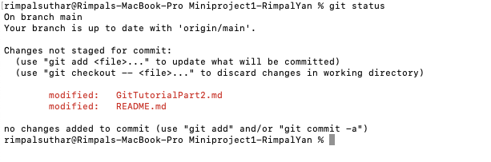

# Git Tutorial Part 2

### 7. Checkout

Updates files in the working tree to match the version in the index or the specified tree. If no pathspec is given, git checkout will also update HEAD to set the specified branch as the current branch.

`git checkout [<branch>]`

_This command is used to switch from one branch to another._

`git checkout -b [<branch>]`

_This command is used to create and switch to the created branch._

### 8. git push

| Command                             |                                        Usage                                         |
| ----------------------------------- | :----------------------------------------------------------------------------------: |
| `git push [variable name] main`     | This command sends the committed changes of master branch to your remote repository. |
| `git push [variable name] [branch]` |           This command sends the branch commits to your remote repository.           |
| `git push –all [variable name]`     |             This command pushes all branches to your remote repository.              |

### 9. git pull

`git pull [<options>] [<repository> [<refspec>…​]]`

Incorporates changes from a remote repository into the current branch. In its default mode, git pull is shorthand for `git fetch` followed by `git merge FETCH_HEAD`.

### 10. git remote add/ remove/ show

- `git remote add`

_Add a remote named `<name>` for the repository at `<url>`. The command `git fetch <name>` can then be used to create and update remote-tracking branches `<name>/<branch>`._

- `git remote rm <name>`

_Remove the remote named `<name>`. All remote-tracking branches and configuration settings for the remote are removed._

- `git remote show <name>`

_Gives some information about the remote `<name>`._

### 11. git status

This command lists all the files that have to be committed.

